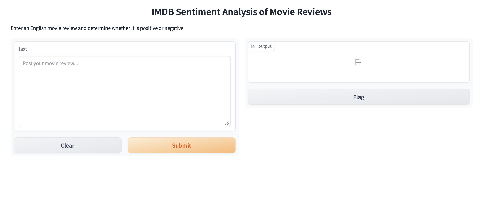

# IMDB Movie Review Sentiment Analysis

Classify English movie reviews as positive or negative using a pretrained DistilBERT model, with a simple web interface built in Gradio.

  

## Features

- Web interface: paste a review and get the predicted sentiment with a confidence score
- Evaluation on the IMDB test set, with accuracy, precision / recall / F1 and a confusion matrix
- Error analysis of misclassified reviews
- Handling of long reviews that exceed the model's 512-token limit

## Tech Stack

- Python
- Hugging Face Transformers, Datasets
- Gradio
- scikit-learn

Model: [`lvwerra/distilbert-imdb`](https://huggingface.co/lvwerra/distilbert-imdb)

## Project Structure

```
├── app.py               # Gradio web interface
├── evaluation.ipynb     # Evaluation and error analysis
├── requirements.txt
└── README.md
```

## Getting Started

```bash
pip install -r requirements.txt

python app.py
```

Then open `http://127.0.0.1:7860` in your browser. The model downloads automatically on first run.

To reproduce the evaluation, open `evaluation.ipynb` and run all cells.

## Results

500 reviews randomly sampled from the IMDB test set (`seed=42`):

| Model | Preprocessing | Accuracy |
|---|---|---|
| distilbert-base-uncased-finetuned-sst-2-english | truncate to 512 tokens | 89.0% |
| distilbert-base-uncased-finetuned-sst-2-english | head + tail truncation | 88.4% |
| **lvwerra/distilbert-imdb** | **head + tail truncation** | **92.0%** |

The biggest gain came from switching models. The first model was fine-tuned on SST-2, which consists of short sentences, while IMDB reviews are long and often mixed in tone. A model fine-tuned on IMDB itself handles them better.

## Handling Long Reviews

DistilBERT accepts at most 512 tokens, and many IMDB reviews are longer. Simple truncation keeps only the beginning, but reviewers often state their verdict at the end. So for long reviews, I keep the first 128 tokens and the last 382 tokens.

With the SST-2 model this made no real difference (89.0% → 88.4%, within noise for 500 samples): it fixed some positive reviews but broke negative reviews whose endings softened in tone. This suggested the model, not truncation, was the main bottleneck, which led to switching models.

## Error Analysis

Reviewing the misclassified examples, the main failure patterns were:

1. **Mixed reviews**: heavy criticism followed by a positive overall verdict ("dumb movie, but I loved it"), or the reverse
2. **Sarcasm**: positive words used to express a negative opinion
3. **Ambiguous labels**: some reviews labeled negative read as neutral or mildly positive

## Possible Improvements

- Fine-tune DistilBERT on the IMDB training set myself
- Evaluate on a larger sample for more stable results
- Deploy the app to Hugging Face Spaces
