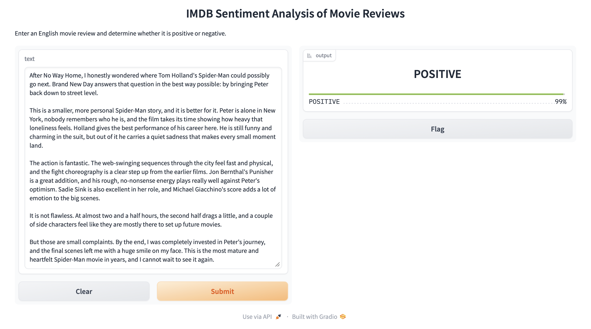
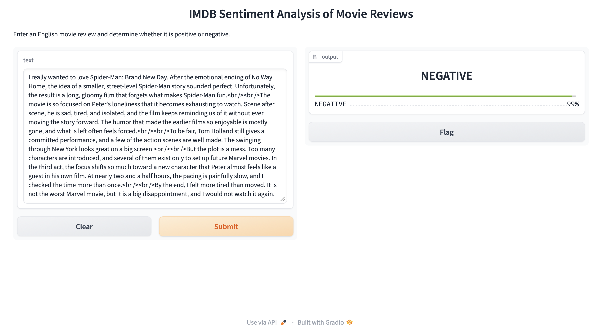

# IMDB Movie Review Sentiment Analysis

Classify English movie reviews as positive or negative using a pretrained DistilBERT model, with a simple web interface built in Gradio.

Positive


Negative



## Features

- Web interface: paste a review and get the predicted sentiment with a confidence score
- Evaluation on the IMDB test set, with accuracy, precision / recall / F1 and a confusion matrix
- Error analysis of misclassified reviews
- Handling of long reviews that exceed the model's 512-token limit

## Tech Stack

- Python
- Hugging Face Transformers, Datasets
- Gradio
- scikit-learn

Model: [`lvwerra/distilbert-imdb`](https://huggingface.co/lvwerra/distilbert-imdb)

## Project Structure

```
├── app.py               # Gradio web interface
├── evaluation.ipynb     # Evaluation and error analysis
├── requirements.txt
└── README.md
```

## Getting Started

```bash
pip install -r requirements.txt

# Launch the web interface
python app.py
```

Then open `http://127.0.0.1:7860` in your browser. The model downloads automatically on first run.

To reproduce the evaluation, open `evaluation.ipynb` and run all cells.

## Results

500 reviews randomly sampled from the IMDB test set (`seed=42`):

| Model | Preprocessing | Accuracy | F1 |
|---|---|---|---|
| SST-2 (`distilbert-base-uncased-finetuned-sst-2-english`) | truncate | 0.892 | 0.889 |
| SST-2 (`distilbert-base-uncased-finetuned-sst-2-english`) | head + tail | 0.884 | 0.881 |
| **IMDB (`lvwerra/distilbert-imdb`)** | **truncate** | **0.926** | **0.925** |
| IMDB (`lvwerra/distilbert-imdb`) | head + tail | 0.920 | 0.919 |

The final app uses the IMDB model with simple truncation.

The biggest gain came from switching models (89.2% → 92.6%). The SST-2 model was fine-tuned on short sentences, while IMDB reviews are long and often mixed in tone. A model fine-tuned on IMDB itself handles them better.

## Handling Long Reviews

DistilBERT accepts at most 512 tokens, and many IMDB reviews are longer. Simple truncation keeps only the beginning, so I hypothesized that reviewers' verdicts at the end were being cut off. To test this, I tried keeping the first 128 and the last 382 tokens of long reviews.

The hypothesis did not hold. Head + tail truncation slightly lowered accuracy for both models (SST-2: 0.892 → 0.884, IMDB: 0.926 → 0.920). Looking at the errors, it fixed some positive reviews with a verdict at the end, but broke negative reviews whose endings softened in tone. The differences are also small enough to be noise at 500 samples. Since head + tail added complexity without improving results, I kept simple truncation.

## Error Analysis

Reviewing the misclassified examples, the main failure patterns were:

1. **Mixed reviews**: heavy criticism followed by a positive overall verdict ("dumb movie, but I loved it"), or the reverse
2. **Sarcasm**: positive words used to express a negative opinion

## Possible Improvements

- Fine-tune DistilBERT on the IMDB training set myself
- Evaluate on a larger sample for more stable results